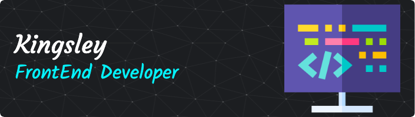

  

## 
Hi, I'm Kingsley. I'm a 🚀 Passionate FrontEnd Developer from Nigeria 🚀

## :link: Connect with Me

  
  
  
  
  

 

<h2 align="left">Favorite Tech</h2>

> Tools, languages, and other things that I like to work with.

<table>
  <tr>
    <td align="center" width="96">
      
       HTML
    </td>
    <td align="center" width="96">
      
       JavaScript
    </td>
    <td align="center" width="96">
      
       CSS
    </td>
    <td align="center" width="96">
      
       React
    </td>
    <!-- <td align="center" width="96">
      
       Bootstrap
    </td> -->
    <!-- <td align="center" width="96">
      
       React Native
    </td> -->
    <!--
    <td align="center" width="96">
      
       TypeScript
    </td> -->
    <!-- <td align="center" width="96">
      
       GoLang
    </td> -->
    <!-- <td align="center" width="96">
      
       Python
    </td> -->
  </tr>
  <!-- <tr>
    <td align="center" width="96"> 
      
       Docker
    </td>
    <td align="center" width="96">
      
       Kubernetes
    </td>
    <td align="center"  width="96">
      
       Debian
    </td>
    <td align="center" width="96">
      
       Powershell
    </td>
    <td align="center"  width="96">
      
       MySQL
    </td>
  </tr> -->
</table>

 

# 💫 A Little More About Me:

- 🌱 I’m currently learning **React, TypeScript, NodeJS, ExpressJS**

- 💬 Ask me about **HTML, CSS, JavaScript and React**

 

## My Stats

  

&nbsp;

